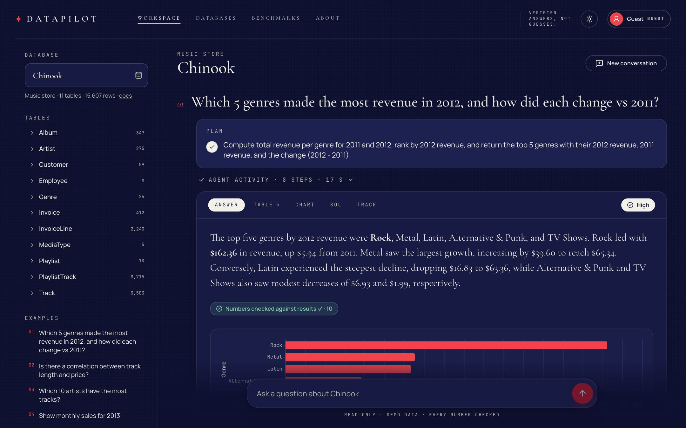
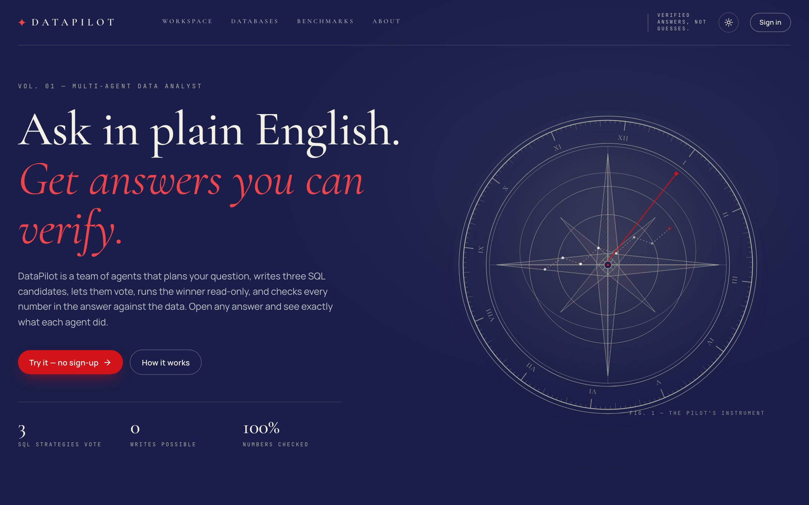
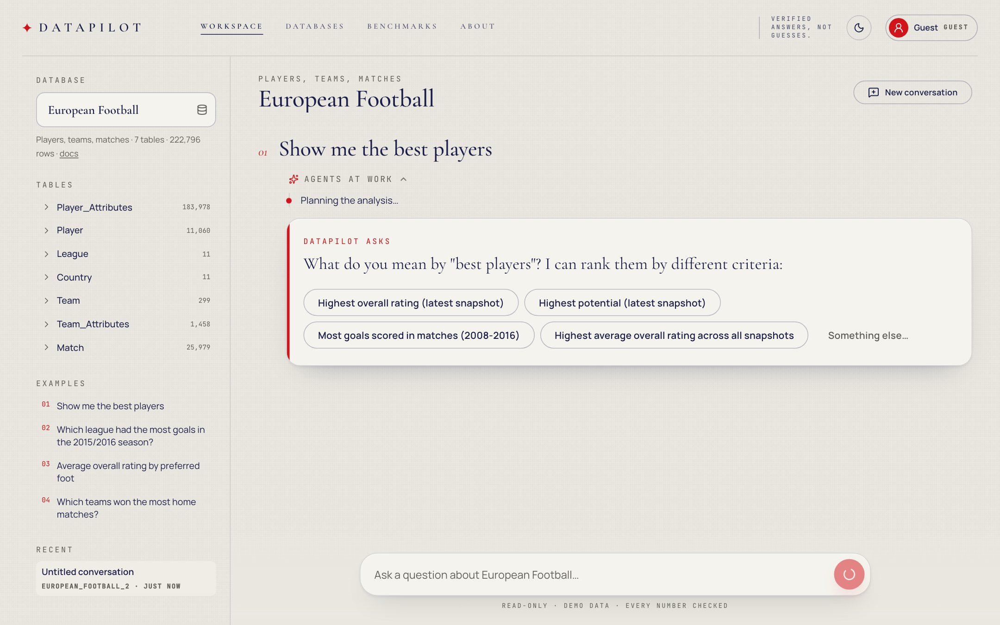
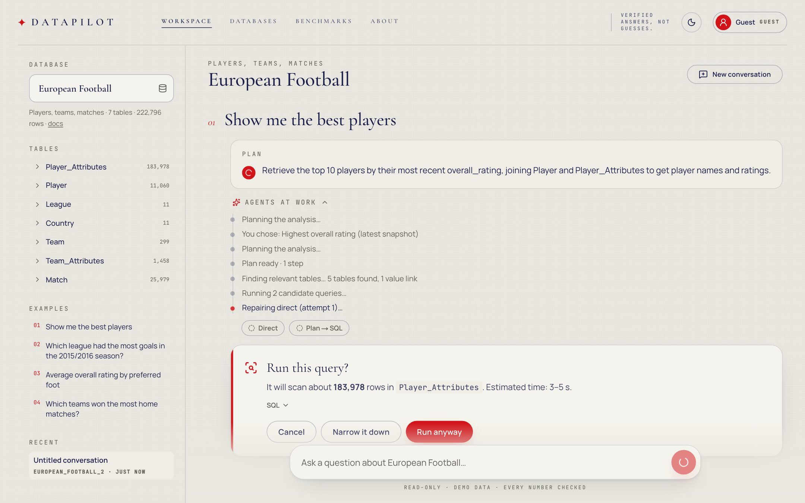
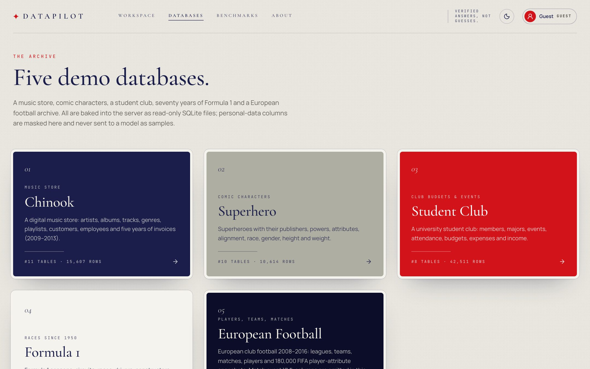
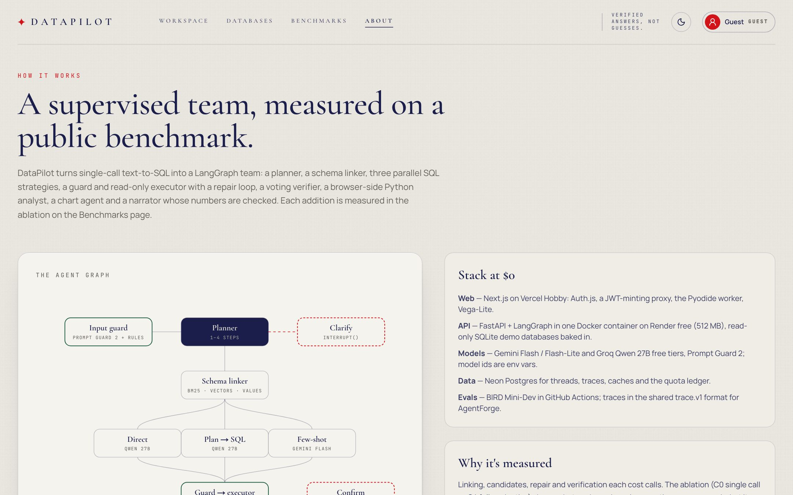
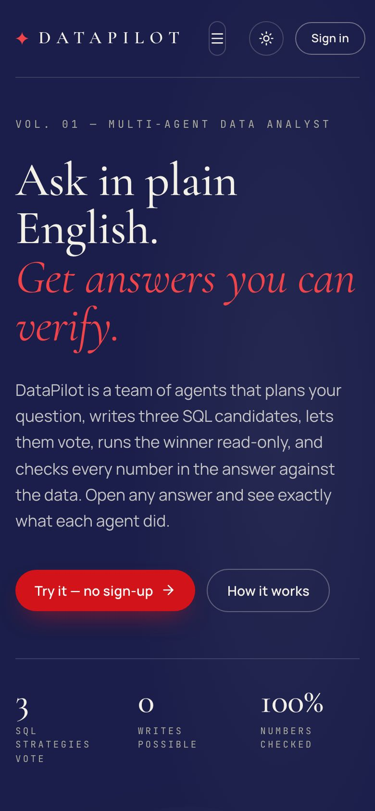
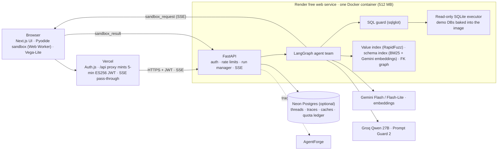
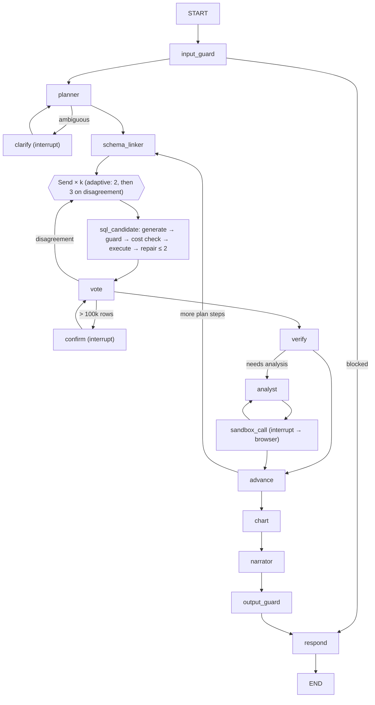

# DataPilot

**A multi-agent data analyst that proves its answers.**
Ask a business question in plain English. A team of agents plans it, links it to the right tables and values, writes three SQL candidates in parallel, lets them vote, runs the winner on a read-only connection, runs Python in *your browser* when statistics are needed, draws a chart, and writes an answer whose every number is checked against the data. Every step is traced, and the system is scored on the public **BIRD Mini-Dev** benchmark.

**Live demo → https://datapilot-analyst.vercel.app** (no sign-up: "Try as guest")

[](https://github.com/Sohail-5678/Datapilot-Multi-Agent-Data-Analyst/actions/workflows/ci.yml)




| Landing | Clarifying question | Expensive-query checkpoint |
|---|---|---|
|  |  |  |

| Databases | How it works | Mobile |
|---|---|---|
|  |  |  |

> **New to the project?** Read the field guide: [`docs/DataPilot-Field-Guide.html`](docs/DataPilot-Field-Guide.html) — the idea, one question traced through every agent, every screen, safety layers, benchmarks, tools and interview prep.

> Demo databases only (Chinook + four BIRD Mini-Dev databases), all read-only. The free API server sleeps after 15 idle minutes, so the first question can take about a minute while it wakes up; the UI says so.

---

## Try it in 3 minutes

1. **Chinook (music store)** → *"Which 5 genres made the most revenue in 2012, and how did each change vs 2011?"* Watch the plan appear, two SQL candidates run in parallel and agree, and the answer card open on **Answer · Table · Chart · SQL · Trace** with a confidence badge ("High — 2 of 2 candidates agree, verifier passed") and "Numbers checked against results ✓".
2. *"Is there a correlation between track length and price?"* The analyst writes pandas; your browser runs it in a Pyodide sandbox (badge: "Ran in your browser · no network"). The answer cites the coefficient.
3. **European Football** → *"Show me the best players"*. The planner refuses to guess and asks: *Highest overall rating · Highest potential · …*
4. Pick an option. The query would scan ~184,000 rows of `Player_Attributes`, so the run pauses: **"Run this query? It will scan about 183,978 rows."** Run anyway, narrow it down, or cancel.
5. Open **Trace** on any answer for the span waterfall (planner → linker → candidates → guard → executor → verifier → chart → narrator → grounding), with models, tokens and list-price cost.
6. **Benchmarks** → the ablation table, the accuracy-vs-cost chart and the failed cases, with gold vs predicted SQL.

### Bring your own data

Signed-in visitors (guests included) can upload **CSV, TSV, Excel (.xlsx — every sheet becomes a table), JSON or SQLite** files — up to 10 MB each, 25 MB per dataset, several files per dataset so they can be joined — and ask questions about them with exactly the same agents, guards, charts and number checks.

- **Ingestion** infers column types (integers, decimals, `$1,234.50` money, `12%` percents, mixed date formats → ISO), rebuilds every identifier as safe snake_case, and builds one read-only SQLite database. Uploaded SQLite files are opened read-only with `trusted_schema=OFF`; only tables are copied (no views or triggers).
- **Privacy:** uploads require explicit consent (free-tier providers may use prompts to improve their models); columns that look personal (emails, phones, names, addresses, IDs) are detected, masked in samples and kept out of prompts and value links; datasets are private to their owner and deleted automatically (guests 1 day, GitHub users 7 days).
- **Durable on free hosting:** the built database is stored zlib-compressed in Postgres and unpacked to a read-only local cache on demand, because Render's disk is wiped when the free instance sleeps.
- **Uploads skip the 4.5 MB serverless body limit:** the web app mints a 5-minute token scoped to `POST /v1/datasets` only, and the browser uploads straight to the API.
- Example questions for each dataset are suggested by Flash-Lite from its schema (rule-based fallback).

---

## Architecture





### Design decisions (the interview version)

- **Read-only, three ways.** The SQL guard parses every statement with sqlglot (one SELECT only; no DDL/DML/PRAGMA/ATTACH; no dangerous functions; allow-listed tables; bounded recursive CTEs; no unconditioned cross joins on big tables; LIMIT ≤ 1,000). The executor opens SQLite with `mode=ro&immutable=1`, `PRAGMA query_only=ON` and an authorizer that only allows reads. The files are `chmod a-w` in the image. A guard bug still can't write; the tests call the executor directly with `DELETE`, `DROP` and `ATTACH` to prove it.
- **Self-consistency with a budget.** Candidates are grouped by an order-aware hash of their result rows. Two agreeing candidates are enough; only a disagreement pays for the third strategy (adaptive k). Ties go to an LLM verifier, which also checks columns, filters and aggregation grain. Confidence is *High* (≥ 2 agree + verifier pass), *Medium* (1 + pass) or *Low*.
- **Schema and value linking.** Small schemas go to the SQL agents whole. Large ones are ranked (BM25 over column cards, plus Gemini embeddings when available), pruned by Flash-Lite to ≤ 8 tables / 40 columns, and joined through shortest paths over the foreign-key graph. Literals in the question are fuzzy-matched against every text column's distinct values, so *"Lewis Hamilton"* lands on `drivers.forename/surname` with the right spelling.
- **Humans at the right moments.** LangGraph `interrupt()` pauses the run for a clarifying question or an expensive scan (EXPLAIN QUERY PLAN estimate > 100,000 rows). The run resumes with `Command(resume=…)`. Events go to a replayable log, so the browser can re-attach if a serverless proxy cuts the stream.
- **Model-written Python never runs on the server.** It runs in Pyodide in a dedicated Web Worker. Before user code runs, `fetch`, XHR, WebSocket, `importScripts` and friends are replaced with throwing, non-configurable stubs, package loading is disabled, and `js`/`pyodide`/`micropip` imports are blocked. A 10-second kill switch terminates the worker. Eval/CI mode runs the identical lockdown in a Node worker (`sandbox/runner.mjs`).
- **Every number is checked.** The output guard extracts each number in the answer. It must match a result value, the analysis result, the question, or a derivation computed by code (difference, percent change, ratio, total, share, rounding; 0.5% tolerance). Otherwise the narrator gets one rewrite with the allowed numbers. If that fails, the sentence is removed and the UI says so. Only checked text is streamed.
- **Optimizable, but not around the guards.** All prompts, strategies and routing live in a versioned `profile.v1` (`backend/profiles/default.json`) that AgentForge can optimize. Guard rules, read-only enforcement, `SCAN_CONFIRM_ROWS`, sandbox limits, grounding, budget ceilings and the PII policy are locked; the loader rejects any profile that tries to set them.
- **Harness engineering.** Per question: ≤ 4 plan steps, ≤ 3 candidates, ≤ 2 repairs each, ≤ 25 LLM calls, ≤ 60K tokens, ≤ 90 s (human wait time excluded). There are retries with backoff and jitter that honor `retry-after`, provider fallback, a circuit breaker per provider, and a daily quota ledger that switches models at 90% and goes "browse-only" when everything is exhausted.

---

## Benchmarks (BIRD Mini-Dev)

- **Data:** a fixed, stratified 150-question subset of the 500-question BIRD Mini-Dev (SQLite, with evidence; seed 13). Splits: train 50 / val 50 / test 50 (`bench/`). The test split is never used for tuning; few-shot examples come only from train.
- **Metric:** execution accuracy (EX) with BIRD's official set comparison, on the full BIRD database files. The harness passes 150/150 gold queries through the guard/executor/EX path in an oracle self-test.
- **Ablation:** C0 single call → C1 + linking → C2 + 3 candidates & voting → C3 + repair & verifier → C4 full + adaptive k. Each config reports EX with a 95% bootstrap CI, LLM calls, tokens, list-price cost per question, and p50/p95 latency.
- **Honesty:** free tiers allow about 8K tokens/min and 1K requests/day per model, so runs accumulate across nights (`--resume`; nightly `bench.yml`). The website shows only numbers that came out of the harness (`bench/summary.json`), and a config appears once it has n ≥ 20. See [Benchmarks](https://datapilot-analyst.vercel.app/benchmarks) for the current state.

```bash
cd backend
uv run python -m datapilot.bench --config C0 --split test --resume --budget-calls 400
uv run python -m datapilot.bench --config C4 --split test --resume --budget-calls 600   # best with GEMINI_API_KEY
uv run python -m datapilot.bench --summarize && pnpm --dir ../apps/web sync:bench
```

---

## Tests

| Layer | What runs |
|---|---|
| SQL guard | 60 malicious/edge statements rejected (DDL/DML, PRAGMA, ATTACH, multi-statement, comment tricks, Unicode tricks, `ON TRUE` cross joins, fake recursion bounds…) and 60 valid SELECTs over the real schemas allowed, unchanged except LIMIT |
| Executor | writes refused even when the guard is bypassed (file hash unchanged); timeout; row cap + full count; EXPLAIN estimator |
| Linking / grounding / input guard / profile | value links found for 30/30 hand-made questions; invented numbers removed, derived ones accepted; 10+ injection cases; locked profile fields rejected |
| Agent graph (fake LLM) | clarify, confirm run/cancel/narrow, repair, vote tie, adaptive k, budget stop, provider fallback, circuit breaker, sandbox + timeout, trace.v1 shape |
| API | auth matrix, owner checks, SSE format, checkpoints over HTTP, rate limits |
| Sandbox | network blocked, `js`/`micropip`/`open()` blocked, infinite loop killed, big data refused (Node runner) |
| Web | Vitest (SSE parser, turn reducer, chart-spec whitelist, safe rich text) + Playwright e2e on the real stack with axe checks: ask → answer → chart → SQL; clarify → confirm; cancel; Python in the browser sandbox; upload a CSV → ask → delete |
| Uploads | type inference (money, percents, dates), hostile identifiers, size/row limits, xlsx/JSON/SQLite parsing (views and triggers dropped), PII tagging; owner-only access, consent, guest limits, expiry, survival of a wiped disk, upload-scoped tokens |
| Evals | `python -m datapilot.eval_adapter run --cases ../evals/cases/smoke.jsonl …` — 10 case.v1 cases incl. data-borne injection, a canary table and SQL injection on fresh DB copies |

```bash
cd backend && uv run pytest -q                 # 482 tests, ~7 s, never calls a provider
cd sandbox && npm ci && npm test               # Pyodide lockdown
cd apps/web && pnpm test && pnpm e2e           # unit + Playwright/axe
```

---

## Run it locally

```bash
# API (offline with the fake model; put GROQ_API_KEY / GEMINI_API_KEY in backend/.env for real models)
cd backend && uv sync && uv run python scripts/fetch_dbs.py
FAKE_LLM=true JWT_PUBLIC_KEY="$(cat dev_jwt.pub)" uv run uvicorn datapilot.api.main:app --port 10000

# Web
cd apps/web && pnpm install
# .env.local: BACKEND_URL=http://127.0.0.1:10000, JWT_PRIVATE_KEY=<base64 PKCS8 PEM>, AUTH_SECRET=<random>
pnpm dev
```

Generate a dev key pair with `openssl ecparam -name prime256v1 -genkey -noout | openssl pkcs8 -topk8 -nocrypt -out dev_jwt.pem && openssl ec -in dev_jwt.pem -pubout -out dev_jwt.pub`. `docker compose up` starts Postgres and the API.

Ask one question from the terminal: `uv run python scripts/ask.py chinook "Which 10 artists have the most tracks?"`.

---

## Deploy ($0)

| Service | Used for | At the limit |
|---|---|---|
| Vercel Hobby | web app (`apps/web`, project `datapilot-analyst`) | pauses, no charge |
| Render free | Docker API (`render.yaml`, service `datapilot-analyst-api`) | sleeps after 15 min; suspends at 750 h |
| Groq free | Qwen 27B candidates, Prompt Guard 2 | HTTP 429 → fallback |
| Gemini API free (optional) | Flash / Flash-Lite / embeddings | HTTP 429 → fallback |
| Neon free (optional) | app Postgres | compute pauses |
| GitHub Actions | CI and benchmark runs (public repo) | — |

1. **API:** [](https://render.com/deploy?repo=https://github.com/Sohail-5678/Datapilot-Multi-Agent-Data-Analyst) (or Render dashboard → **New → Blueprint** → this repo). Paste `GROQ_API_KEY` (required); `GEMINI_API_KEY` and a Neon `DATABASE_URL` are optional. Without Neon, conversations live in an ephemeral SQLite file that resets when the free instance restarts. The public half of the web app's signing key is already in `render.yaml`.
2. **Web:** `cd apps/web && vercel deploy --prod`. Env: `BACKEND_URL`, `JWT_PRIVATE_KEY`, `AUTH_SECRET`, optional `AUTH_GITHUB_ID`/`AUTH_GITHUB_SECRET` (OAuth callback `https://datapilot-analyst.vercel.app/api/auth/callback/github`), `ADMIN_GITHUB_USERS`.
3. **Benchmarks in CI:** add `GROQ_API_KEY_BENCH` (and optionally `GEMINI_API_KEY`) as repository secrets, then Actions → **bench** → Run workflow.

---

## Deviations from the spec (deliberate)

- **ES256 instead of HS256** for web → API tokens. The web app holds the private key; the API holds only the public key (published in `render.yaml`), so a leaked API config can't mint tokens.
- **Embeddings stored as JSON, ranked in Python** instead of pgvector HNSW. The corpora are tiny (~430 column cards, a few hundred cached questions), so a cosine scan takes under a millisecond. The same code then runs on SQLite in CI and on the eval adapter's throwaway databases, and Neon becomes optional.
- **The SQL candidate is one node** that runs generate → guard → cost check → execute → repair as traced sub-spans, instead of separate graph nodes. Parallel `Send` branches then can't interleave writes to shared state.
- **In-memory checkpointer** for paused runs (Render runs a single instance; pauses expire after 15 minutes). Finished runs, spans and results are persisted.
- **`european_football_2` is slimmed** for the 512 MB server: the `Match` table's eight event-XML columns are NULL (no BIRD question reads them; the schema is unchanged). Benchmarks always use the full BIRD files.
- **Groq-only operation is supported.** If no Gemini key is configured, the main steps fall back to Qwen 27B and then to `gpt-oss-120b` (a small 10%-headroom share, since §S.1 assigns that model mainly to ReturnPilot). Flash-Lite steps fall back to rules (top-k schema pruning, rule-based charts).
- **Streaming is of checked text.** The narrator's draft is grounded first, then streamed, so no ungrounded number ever reaches the screen.

## Limitations

- Free-tier models (Qwen 27B / Gemini Flash) are far from state-of-the-art on BIRD; the goal is a measured improvement over a single-call baseline, not a leaderboard entry.
- Answers about personal-data columns are shown in the table, but those values are kept out of prompts, so the narrator describes such results without naming people.
- The value index covers text columns with ≤ 50,000 distinct values and short strings; free-text columns aren't linked.
- The first Pyodide load downloads about 10 MB from jsDelivr (cached afterwards).

## Credits & licenses

- **BIRD Mini-Dev** (CC BY-SA 4.0): superhero, student_club, formula_1, european_football_2 databases and benchmark questions. [bird-bench.github.io](https://bird-bench.github.io/)
- **Chinook** by Luis Rocha (MIT): [lerocha/chinook-database](https://github.com/lerocha/chinook-database)
- Built with LangGraph, FastAPI, sqlglot, RapidFuzz, NetworkX, Pyodide, Next.js, Auth.js, Vega-Lite, Recharts and Shiki.
- Visual identity "Vélora": Midnight Navy `#1B1E4A`, Warm Stone Grey `#AFAEA2`, Crimson Red `#D21319`; Cormorant Garamond, Manrope and JetBrains Mono.

Part of a trio: **DataPilot** and **ReturnPilot** are the agents; **AgentForge** evaluates, red-teams and optimizes both via the shared `trace.v1` / `profile.v1` / `case.v1` contracts (`docs/SPEC.md` §S).
